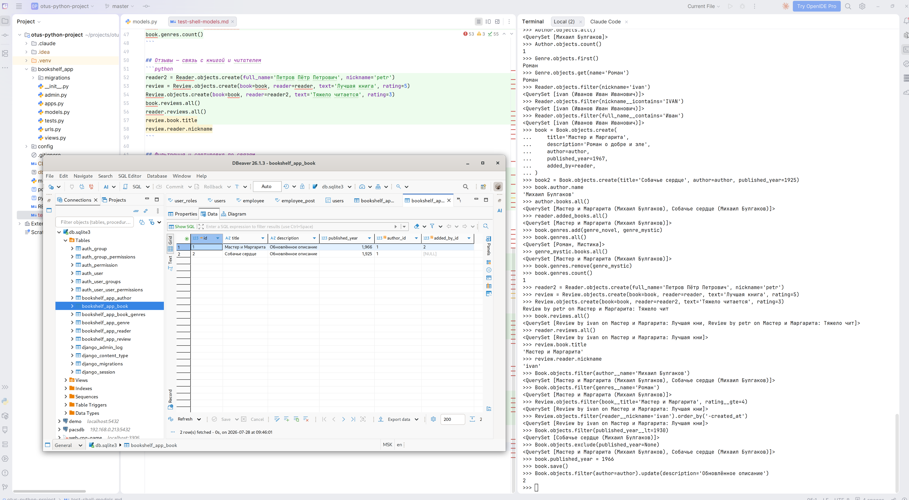

# Сайт "Дневник читателя".
Цепочка домашних заданий OTUS курс "Python Developer. Basic".

В итоге получится проектная работа.


## Оглавление тэгов
Каждый тэг - это сданный и принятый этап (домашнее задание).

| Тэг        | Этап                                                                                          |
|------------|-----------------------------------------------------------------------------------------------|
| `stage-1`  | Этап 1. Домашнее задание: Создание проекта, работа с моделями и продвинутая настройка админки |
| `stage-2`  | Этап 2. Домашнее задание: Шаблоны и формы                                                     |

## Описание
"Дневник читателя" (bookshelf_app) - это сайт на котором пользователи могут писать свои отзывы о прочитанных книгах.

Книги хранятся в общем каталоге, что позволяет оставлять комментарии к книгам, которые добавили другие пользователи.


## Установка зависимостей (poetry)
```shell
# Для Ubuntu
pip install poetry

# Для Debian 13
curl -sSL https://install.python-poetry.org | python3 -
poetry config virtualenvs.in-project true

# Зависимости
poetry install

# Загрузка окружения
source .venv/bin/activate
```


## Миграции
```shell
python manage.py makemigrations
python manage.py migrate
```

## Демо данные
В папке `./fixtures` хранятся данные для предварительного наполнения базы и демо-данные.
Для загрузки данных в базу можно использовать импорт или генерацию случайных данных:
```shell
# Импорт данных в новую базу
python manage.py loaddata ./fixtures/bookshelf_basedata_fixtures.json # Минимальное наполнение для работы
python manage.py loaddata ./fixtures/bookshelf_demodata_fixtures.json # Примеры данных для тестов и наглядности

# Экспорт данных
python manage.py dumpdata bookshelf_app --indent 4 > ./fixtures/bookshelf_export.json

# Генерация случайных данных
python manage.py gen_data

# Создать пользователя Админа для /admin
python manage.py createsuperuser
```

## Запуск сервера
```shell
python manage.py runserver
```


- [Команды проверки моделей в shell](test-shell-models.md)
- 


# Этапы разработки
Каждый этап - это новое домашнее задание по курсу.


## Этап 1: 
Домашнее задание
Создание проекта, работа с моделями и продвинутая настройка админки

**Цель:**
Закрепить навыки создания проекта и приложения в Django, работы с моделями через ORM, а также настройки админки для удобной работы с данными.

**Результат:**
Рабочий проект Django с подключённой базой данных, продвинутой настройкой админки, кастомными командами и генерацией данных через фабрики.

**Описание/Пошаговая инструкция выполнения домашнего задания:**
1. Создать Django проект и приложение:
    - Настроить новый проект Django.
    - Добавить приложение (например, store). 
2. Создать модели:
   - Модель Product с полями: name, description, price, created_at.
   - Модель Category с полями: name, description.
   - Связать Product с Category через ForeignKey.
3. Выполнить миграции:
   - Создать и применить миграции.
4. Работа с ORM:
   - Создать записи для моделей, используя кастомную команду.

**Критерии оценки:**
Создание проекта и настройка моделей.
Рекомендуем сдать до: 04.08.2026


## Этап 2:
Домашнее задание
Шаблоны и формы

**Цель:**
Закрепить навыки работы с HTML-шаблонами, передачи данных из контроллеров в шаблоны и реализации форм для пользовательского ввода.

**Результат:**
Динамическое веб-приложение для интернет-магазина с отображением данных через шаблоны и возможностью добавления и редактирования товаров через формы.

**Описание/Пошаговая инструкция выполнения домашнего задания:**
1. Создать шаблоны:
   - Настроить базовый шаблон с использованием block и extends.
   - Создать страницу списка товаров (Product), где отображаются название, описание и цена.
   - Настроить страницу деталей товара с выводом всех данных.
2. Создать формы:
   - Настроить форму для добавления нового товара.
   - Настроить форму для редактирования товара.
3. Связь с шаблонами:
   - Настроить отображение ошибок валидации в шаблонах.
   - Реализовать обработку пользовательского ввода через контроллеры.
4. Настроить админку:
   - Добавить кастомизацию: list_display, list_filter, search_fields.
   - Создать кастомные действия через @admin.action. Например, поменять цену или опубликовать товар.

**Критерии оценки:**
Реализованы шаблоны для списка и деталей товаров.
Формы работают корректно, включая валидацию.
Настройка админки с кастомизацией.
Рекомендуем сдать до: 16.08.2026

